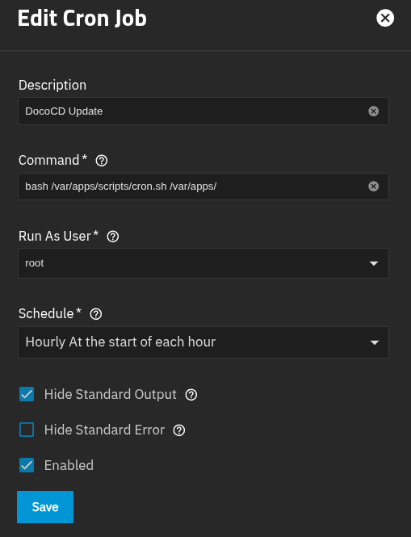

# TrueNAS Apps

GitOps source of truth for applications running via Docker on my TrueNAS home server, managed by [doco-cd](https://github.com/kimdre/doco-cd), a lightweight GitOps controller for Docker Compose.

## Overview

This repository defines all the Docker Compose stacks deployed on my homelab TrueNAS server. Changes pushed to `main` are automatically picked up and applied by doco-cd, making the repo the single source of truth for what runs on the server. Infrastructure provisioning for services like Nexus and Garage is managed with [OpenTofu](https://opentofu.org/), and secrets are injected at deploy time from [1Password](https://1password.com/).

## Repository Structure

```bash
.
├── apps/                      # Docker Compose application stacks
├── bootstrap/                 # doco-cd bootstrap stack
├── infrastructure/            # OpenTofu configurations
├── scripts/                   # Automation scripts
├── .taskfiles/                # Task runner definitions
├── .doco-cd.yaml              # doco-cd configuration
├── Taskfile.yaml              # Task runner entrypoint
└── .mise.toml                 # Tool version management
```

## Infrastructure as Code

The `infrastructure/` directory contains OpenTofu configurations that provision resources inside deployed services:

- **Nexus** — various proxy/hosted/group repositories, roles, users, and security realms.
- **Garage** — S3 buckets and access keys

## Initial Setup

1. SSH into the TrueNAS server
2. Create the secret directory and token file:

   ```bash
   mkdir -p /root/.doco-cd
   echo "<1password-service-account-token>" > /root/.doco-cd/1pw_token
   ```

3. Clone the repo:

   ```bash
   git clone https://github.com/mirceanton/truenas-apps /var/apps
   ```

4. Deploy the bootstrap compose stack:

   ```bash
   cd /var/apps/bootstrap
   docker compose up -d
   ```

5. Create a CronJob in TrueNAS to run `scripts/cron.sh` on a schedule (e.g. hourly):

   

From this point on, *everything* is self-managing.

## How It Works

### Auto-Discovery

doco-cd uses `auto_discover: true` with `depth: 1`, meaning it automatically finds and deploys any subdirectory under `apps/` containing a `compose.yaml`. Adding a new app is as simple as creating a new folder with a compose file. The `delete: true` option ensures that removing a directory also tears down the corresponding stack.

### Secret Management

Secrets are managed through **1Password** using doco-cd's built-in secret provider integration. A 1Password service account token is stored on the TrueNAS host at `/root/.doco-cd/1pw_token`, and doco-cd injects secrets from 1Password vaults into compose stacks as environment variables at deploy time.

### Self-Updating Bootstrap

The `scripts/cron.sh` script runs as a TrueNAS CronJob. It fetches the latest changes from the repository, checks for updates in the `bootstrap/` directory, and if any are found, runs `docker compose up -d` to apply them. The script waits for all containers to become healthy before finishing, ensuring the doco-cd stack itself stays up to date.

## License

[MIT](LICENSE)
